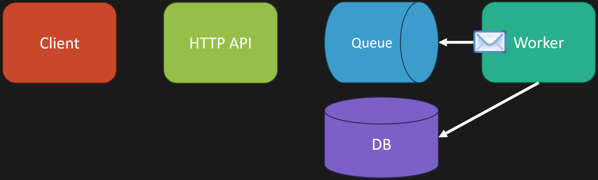

---

title: Node.js Queue Workers in Production

description: A test post to validate Markdown code formatting, syntax highlighting, and raw HTML image rendering.

date: 2026-03-06

tags: [Node.js, Backend, Performance, Queues]

slug: nodejs-queue-workers-production-test

featured: false

ogImage: ../images/scalable-nodejs-queue-system/queue.png

---

  

## Why this test post exists

  

This post intentionally includes multiple Node.js code snippets and one raw HTML image so you can verify:

  

- fenced code blocks render correctly

- code formatting is preserved

- language labels are respected

- raw HTML image paths resolve as expected

  

## 1) Basic Node.js HTTP server

  

```js
import http from "node:http";  

const server = http.createServer((req, res) => {
	if (req.url === "/health") {
		res.writeHead(200, { "content-type": "application/json" });
		res.end(JSON.stringify({ ok: true, service: "queue-api" }));
		return;
	}
	
	res.writeHead(404, { "content-type": "application/json" });
	
	res.end(JSON.stringify({ error: "Not found" }));
});

server.listen(3000, () => {
	console.log("API listening on :3000");
});
```

  

## 2) Queue producer (Node.js + BullMQ)

  

```ts

import { Queue } from "bullmq";

import IORedis from "ioredis";

  

const connection = new IORedis(process.env.REDIS_URL ?? "redis://127.0.0.1:6379");

const emailQueue = new Queue("email-jobs", { connection });

  

export async function enqueueWelcomeEmail(userId: string, email: string) {

await emailQueue.add(

"welcome-email",

{ userId, email },

{

attempts: 5,

backoff: { type: "exponential", delay: 2000 },

removeOnComplete: 1000,

removeOnFail: 2000

}

);

}

```

  

## 3) Worker with concurrency and graceful shutdown

  

```ts

import { Worker } from "bullmq";

import IORedis from "ioredis";

  

const connection = new IORedis(process.env.REDIS_URL ?? "redis://127.0.0.1:6379");

  

const worker = new Worker(

"email-jobs",

async (job) => {

const { userId, email } = job.data as { userId: string; email: string };

console.log(`Processing welcome email for ${userId} -> ${email}`);

// Simulate delivery call

await new Promise((resolve) => setTimeout(resolve, 120));

return { delivered: true };

},

{ connection, concurrency: 16 }

);

  

worker.on("completed", (job) => {

console.log(`Job ${job.id} completed`);

});

  

worker.on("failed", (job, err) => {

console.error(`Job ${job?.id} failed`, err);

});

  

const shutdown = async () => {

console.log("Shutting down worker...");

await worker.close();

await connection.quit();

process.exit(0);

};

  

process.on("SIGINT", shutdown);

process.on("SIGTERM", shutdown);

```

  

## 4) Example config JSON

  

```json

{

"name": "queue-worker-service",

"retryPolicy": {

"attempts": 5,

"backoffMs": 2000

},

"concurrency": 16,

"healthcheckPath": "/health"

}

```

  

## 5) Example command flow

  

```bash

# API

node ./src/server.js

  

# Worker

node ./dist/worker.js

```

  

## 6) Raw HTML image test (relative path)

  



  

## 7) Small optimization notes

  

1. Keep queue payloads lean to reduce Redis memory pressure.

2. Use idempotency keys for retry-safe writes.

3. Separate CPU-heavy jobs from IO-heavy jobs into different workers.